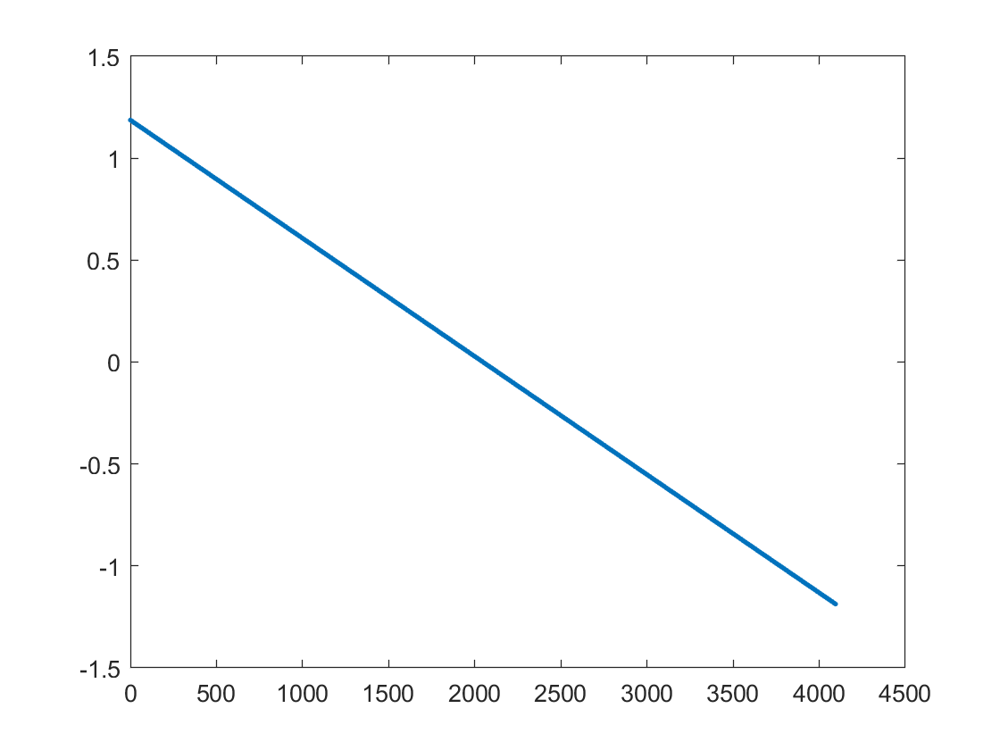
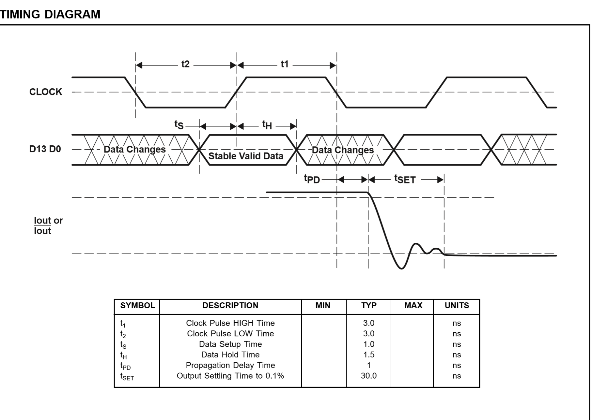
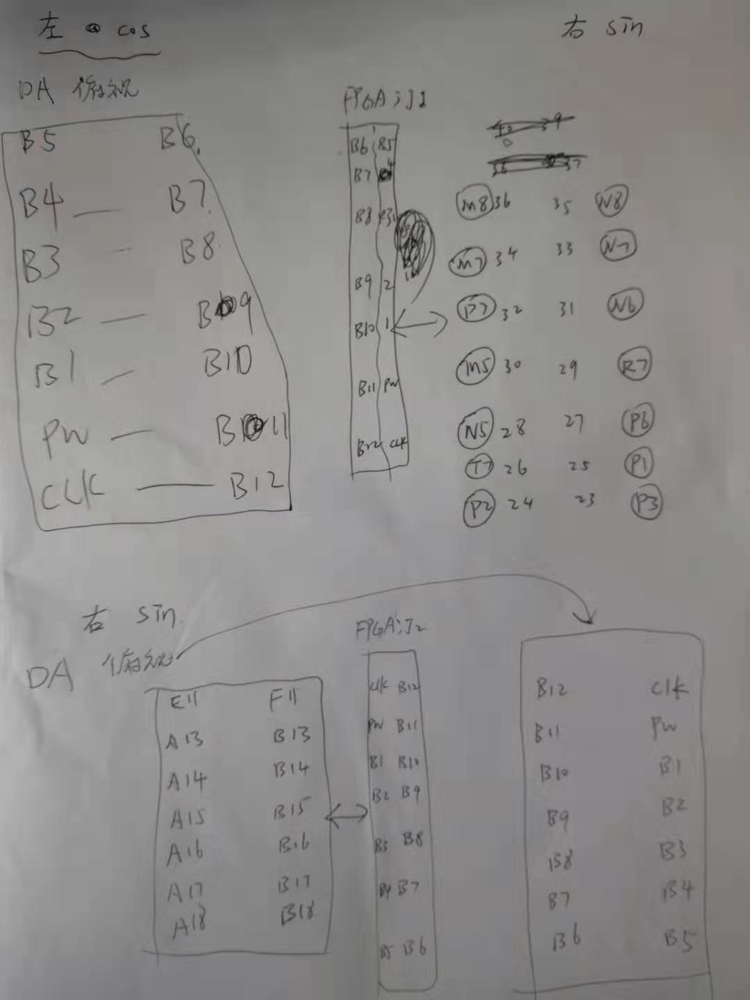

# 基于FPGA & DAC902E 模块的正交扫频信号源

### About DAC902E

DAC902E在5V供电时的最大采样率为125M（即更新一次数据需要8ns）

虽标称165MSPS，但无法达到。存疑

使用5V供电采样率高于3V供电时的采样率

输出变化较小所需时间更短

5V供电的LogicHigh为5V，但实际测试中3V被判定为高电平

输入数据和输出（实际为电流输出）的关系如下图：DacOut = -5.79731E-4 * reg + 1.187

（其中reg为12bit）

DAC的工作时序：

### About Control

此次控制DAC902E工作在100M时钟下

时钟信号由FPGA引脚控制：FPGA的时序如下

根据DAC的工作时序，在更改数据地址后等待2ns，将romclk置高，使得DAC的数据被改变。再等待2ns，将DAC引脚的数据“写入DAC”。再等待10ns，将DAC的clk置0，DAC开始输出数据

此工程基于“m个周期中有n个点”查表法，用matlab生成两个正交的正弦数据表（此表存在片上ROM中）。表中正弦的参数如下：

- VPP 1.187/4
- 从1M到40M每个周期100个点，顺序排列
- Datar为右边的DAC的输入数据，是在sin中抽取的点
- Datal为左边的DAC的输入数据，是在cos中抽取的点
- 相移 : +0.2/2 $$\pi $$ $$\times$$ $$360^\circ $$ 

### Warnings!

为保证一切正常，需要：

- 输出接50 Ω 负载
- DAC正确供电
- FPGA正确供电
- DAC与FPGA共地

### PinConfiguration

